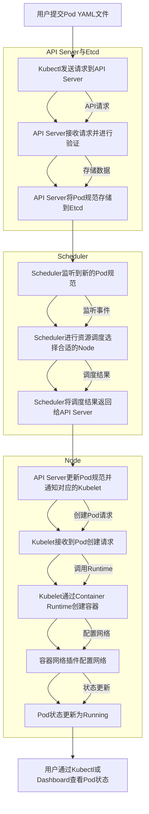
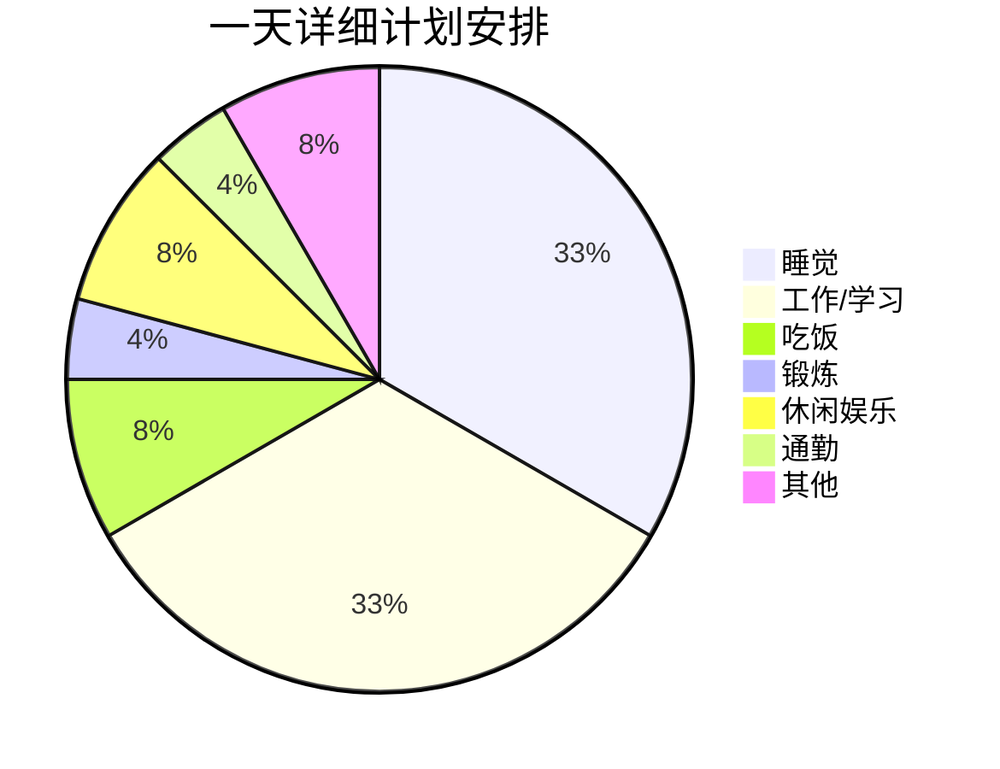

## 1. 简介

[Mermaid](https://mermaid.js.org/) 是一种基于 JavaScript 的工具和库，用于生成各种类型的图表和图形，特别是在 Markdown 文档中嵌入图表时非常有用。Mermaid 允许用户使用简单的语法来描述复杂的图表，而不需要手动绘制图表。它特别适合开发者和文档编写者，能够在技术文档、项目文档和知识库中快速创建可视化内容。

Mermaid 支持以下类型的图表：

- 流程图 (Flowchart)：用于描述流程或工作流程。
- 序列图 (Sequence Diagram)：用于表示对象之间的交互。
- 类图 (Class Diagram)：用于表示类和它们之间的关系。
- 状态图 (State Diagram)：用于描述状态机或状态转换。
- 甘特图 (Gantt Diagram)：用于项目管理和时间安排。
- ER 图 (Entity Relationship Diagram)：用于描述数据库实体及其关系。
- 用户旅程图 (User Journey)：用于展示用户体验过程。


## 2. 教程

### 2.1 流程图

咨询 [chatGPT](https://chatgpt.com/) 写一个流程图。


这个流程图详细说明了在 Kubernetes 集群中创建 Pod 的主要步骤：

- 用户提交Pod YAML文件：用户通过 Kubectl 提交 Pod 的 YAML 文件。
- Kubectl发送请求到API Server：Kubectl 将用户的请求发送到 Kubernetes API Server。
- API Server接收请求并进行验证：API Server 接收到请求后，对 Pod 规范进行验证。
- API Server将Pod规范存储到Etcd：验证通过后，API Server 将 Pod 规范存储到 Etcd 中。
- 监听到新的Pod规范：Scheduler 监听到 Etcd 中的新 Pod 规范。
- Scheduler进行资源调度，选择合适的Node：Scheduler 评估集群资源，选择一个合适的节点（Node）来运行 Pod。
- Scheduler将调度结果返回给API Server：Scheduler 将调度结果返回给 API Server。
- API Server更新Pod规范并通知对应的Kubelet：API Server 更新 Pod 规范，并通知对应节点上的 Kubelet。
- Kubelet接收到Pod创建请求：节点上的 Kubelet 接收到创建 Pod 的请求。
- Kubelet通过Container Runtime创建容器：Kubelet 使用容器运行时（如 Docker、containerd）来创建 Pod 中的容器。
- 容器网络插件配置网络：容器网络插件（如 CNI 插件）配置 Pod 的网络。
- Pod状态更新为Running：Pod 的状态更新为 Running，表示 Pod 已经成功启动并运行。
- 用户通过Kubectl或Dashboard查看Pod状态：用户可以通过 Kubectl 或 Kubernetes Dashboard 查看 Pod 的状态。


这个流程图展示了 Kubernetes 在创建 Pod 时的内部工作流程，从用户提交规范到 Pod 最终运行的每个关键步骤。

```bash
graph TD
    A[用户提交Pod YAML文件] --> B[Kubectl发送请求到API Server]
    B --> C[API Server接收请求并进行验证]
    C --> D[API Server将Pod规范存储到Etcd]
    D --> E[Scheduler监听到新的Pod规范]
    E --> F[Scheduler进行资源调度，选择合适的Node]
    F --> G[Scheduler将调度结果返回给API Server]
    G --> H[API Server更新Pod规范并通知对应的Kubelet]
    H --> I[Kubelet接收到Pod创建请求]
    I --> J[Kubelet通过Container Runtime创建容器]
    J --> K[容器网络插件配置网络]
    K --> L[Pod状态更新为Running]
    L --> M[用户通过Kubectl或Dashboard查看Pod状态]

    subgraph API Server与Etcd
        B -->|API请求| C
        C -->|存储数据| D
    end

    subgraph Scheduler
        E -->|监听事件| F
        F -->|调度结果| G
    end

    subgraph Node
        H -->|创建Pod请求| I
        I -->|调用Runtime| J
        J -->|配置网络| K
        K -->|状态更新| L
    end

```

输出



### 2.2 饼状图


```bash
pie
    title 一天详细计划安排
    "睡觉" : 8
    "工作/学习" : 8
    "吃饭" : 2
    "锻炼" : 1
    "休闲娱乐" : 2
    "通勤" : 1
    "其他" : 2

```

输出：




- 官方教程： [https://mermaid.js.org/syntax/flowchart.html#graph](https://mermaid.js.org/syntax/flowchart.html#graph)
- [https://mermaid.js.org/](https://mermaid.js.org/)
- [https://github.com/mermaid-js/mermaid](https://github.com/mermaid-js/mermaid)
- 在线mermaid： https://www.min2k.com/tools/mermaid/
- [https://chatgpt.com/](https://chatgpt.com/)
